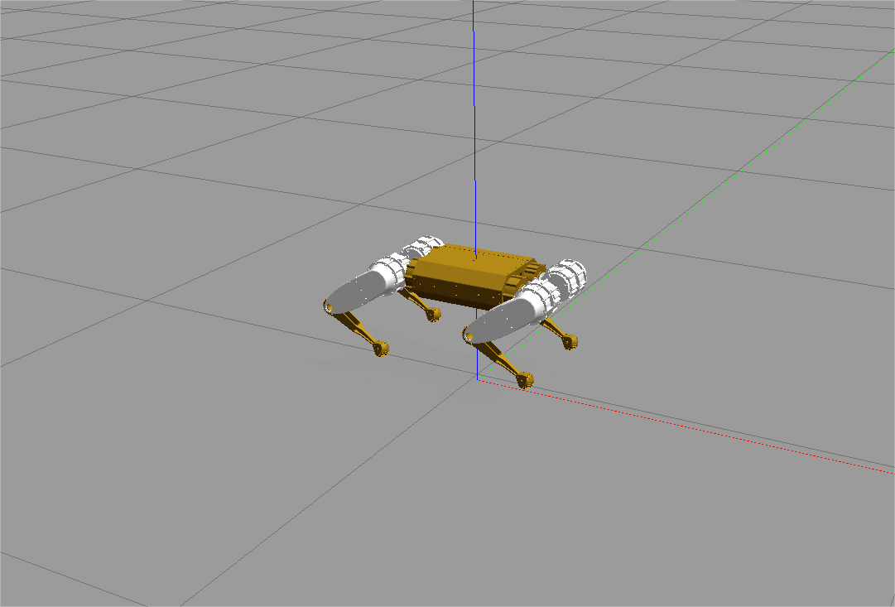

# OpenPaws: Open-Source Quadruped Robotic Framework

OpenPaws is an open-source framework designed for building Field Oriented Control (FOC) motor-based quadruped robotic pets. This project focuses on delivering low-cost, modular, and cross-platform solutions in both software and hardware to robotics enthusiasts and developers.

## Our Philosophy

OpenPaw is a project created by and for the open-source community. We believe in the principles of transparency, collaboration, and innovation. By sharing our work, we hope to contribute to the growth of the robotics ecosystem and empower others to build upon it.

## Leg Assembled

<video width="600" height="400" autoplay="true" loop="loop" src="https://github.com/user-attachments/assets/bd47f27d-9aae-4291-96b1-75f8b6b39cad"></video>

## Installation

## Step 1: WSL2 Configuration (Windows 10/11 Only)

(Skip this step if you are already on native Ubuntu/Linux.)

**1. Enable Virtualization**

- Open Task Manager → ​**​Performance​**​ tab → Verify ​**​Virtualization​**​ is enabled.
- If disabled, enable it in BIOS/UEFI settings.

​**2. ​Install WSL2**

```bash
# Powershell
wsl --install -d Ubuntu-22.04  # Install Ubuntu distribution
wsl --set-default-version 2    # Set WSL2 as default
wsl --update                   # Update WSL kernel
```

​**​3. Install X Server for GUI**

- Download ​**​XLaunch**​ from [sourceforge.net](https://sourceforge.net/projects/xlauncher/)

- Launch XLaunch and select ​**​"Disable access control"​**​ to allow Docker GUI display

## Step 2: Docker Installation

​**1. ​Install Docker Desktop for Windows**

- Download from [Docker Hub](https://hub.docker.com/editions/community/docker-ce-desktop-windows).
- Enable ​**​WSL2 Integration​**​ in Docker Desktop settings.

​**2. ​Configure Docker in WSL2 (Ubuntu Terminal)**

```bash
# Add Docker's official GPG key andrepository
sudo mkdir -p /etc/apt/keyrings
curl -fsSL https://download.docker.com/linux/ubuntu/gpg | sudo gpg --dearmor -o /etc/apt/keyrings/docker.gpg
echo "deb [arch=$(dpkg --print-architecture) signed-by=/etc/apt/keyrings/docker.gpg] https://download.docker.com/linux/ubuntu $(lsb_release -cs) stable" | sudo tee /etc/apt/sources.list.d/docker.list > /dev/null

# Install Docker
sudo apt update
sudo apt install -y docker-ce docker-ce-cli containerd.io
```

## Step 3: Project Setup and Docker Execution

**1. Clone Repository**

```bash
# Clone from GitHub (primary)
git clone https://github.com/wangpuhk1/openpaws.git

# Alternative mirror (if GitHub is inaccessible) 
git clone https://gitcode.com/wangpuhk1/openpaws.git
```

**2. Pull and Configure Docker Image**

```bash
docker pull docker.1ms.run/fishros2/ros:melodic-desktop-full
docker tag docker.1ms.run/fishros2/ros:melodic-desktop-full openpaws:v2.2
```

**​3. Launch Container with GUI Support**

```bash
# On Host Machine (Windows/WSL2, Ubuntu), 
# Enable GUI Support
xhost +

# Launch Container
docker run -it --name openpaws \
  --net=host \                  # Use host network (firewall may block)
  --privileged \                # Grant device access (use cautiously)
  -v /tmp/.X11-unix:/tmp/.X11-unix \          # Share X11 socket[3,7](@ref)
  -e DISPLAY=host.docker.internal:0.0 \       # Windows X Server address
  -e GDK_SCALE=1.5 \            # HiDPI scaling for high-res screens
  -e GDK_DPI_SCALE=0.8 \  
  -v "$(pwd)/openpaws:/root/openpaws" \  
  openpaws:v2.2
```

## Step 4: ROS Workspace Build (Inside Container)​

**1. ​Install Dependencies**

```bash
apt-get update && apt install ca-certificates
rosdep install --from-paths src --ignore-src -r -y
```

**2. Compile ROS Packages** 

```bash
cd /root/openpaws/software/ROS1
source /opt/ros/melodic/setup.bash
catkin_make
```

## Step 5: Launch Gazebo Simulation (Inside Container)​

```bash
cd /root/openpaws/software/ROS1

source devel/setup.bash  # Load ROS environment variables

roslaunch openpaws_config gazebo.launch
```



## Step 6: Start Teleoperation

```bash
# --------------------------------
# On Host Machine (Windows/WSL2, Ubuntu)
# --------------------------------
# 1. Open a new terminal window in WSL2/Ubuntu
# 2. Attach to the running Docker container

docker exec -it openpaws /bin/bash

# --------------------------------
# Inside Docker Container
# --------------------------------
# Navigate to ROS workspace and initialize environment

cd /root/openpaws/software/ROS1
source devel/setup.bash
# Launch teleoperation interface with GUI support
roslaunch openpaws_teleop teleop.launch
```

## Step 4: Hardware Integration

Create a hardware interface for your actuators that is able to do the following:

- Subscribe to [trajectory_msgs/JointTrajectory](http://docs.ros.org/melodic/api/trajectory_msgs/html/msg/JointTrajectory.html) . This ROS message contains the joint angles (12DOF) that the actuators can use to move the robot.

- Publish all the actuators' current angle using [sensor_msgs/JointState](http://docs.ros.org/melodic/api/sensor_msgs/html/msg/JointState.html) to 'joint_states' topic.

- Control the actuators and read its angle (optional) programmatically.

## Community

Join our community to share ideas, ask questions, and collaborate:  

- [Discord Channel](https://discord.gg/qjGJGtSM)
- [wechat/微信]


## License

OpenPaw is licensed under the MIT License. See `LICENSE` for more details.

## Acknowledgments

Some code and design are borrowed from following projects:  
[Cheetah](https://github.com/mit-biomimetics/Cheetah-Software)  
[Champ](https://github.com/chvmp/champ)  
[3D model Design](https://oshwhub.com/gulu666/detector-disaster-scene-3d-reconstruction-robot-dog)  
Thanks for their contributions!
